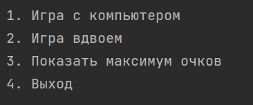
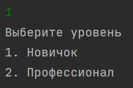
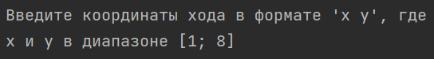
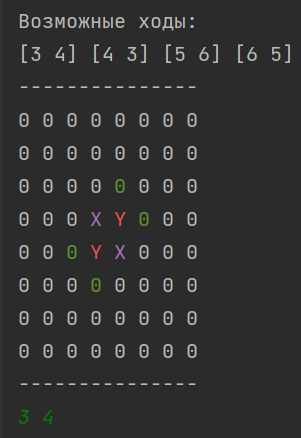
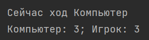
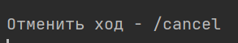
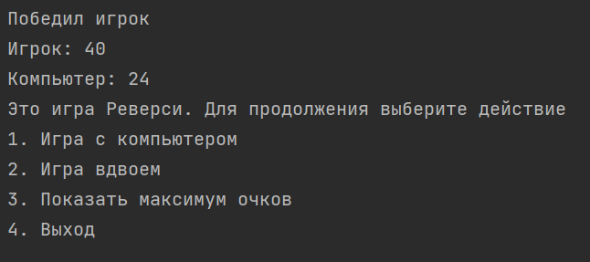

# Reverse Game

## Критерии

По критериям программа сделана на 10 баллов. Реализованы все дополнительные функции:

- Игра в легком режиме
- Игра в сложном режиме
- Игрок против игрока
- Меню для запуска в разных режимах
- Возможность отмена хода (на 1 ход назад)
- Вывод всех вариантов хода игрока
- Визуализация ходов для игрока

## Функционал

### Главное меню

Тут можно выбрать действие. Нужно ввести в консоль число от 1 до 4. При других данных будет выведена ошибка

### Уровень сложности

Тут можно выбрать уровень компьютера. Нужно ввести в консоль число от 1 до 2. При других данных будет выведена ошибка

### Как ходить

Нужно ввести в консоль координаты, например, <3 4> (показано на фото). Координата <0 0> в левом нижнем углу

На поле можно видеть 4 формата фишек:

-  `0 - Пустые клетки`
-  `0 - Возможные ходы для игрока`
-  `X - Фишки игрока`
-  `Y - Фишки компьютера`

После каждого хода отображается количество очков

### Отмена хода

После вашего хода и хода компьютера можно отменить ход

Для этого напишите в консоль команду /cancel. Чтобы не отменять ход, напишите любое другое слово/символ. 

### Конец игры

В конце игры пишется, кто выиграл. Также снова показывается меню, то есть программа не завершается.
